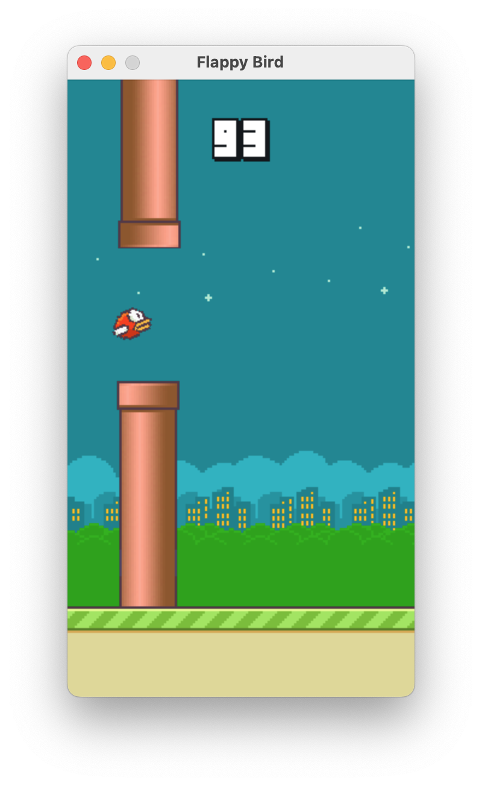

# Flappy Bird
This is copy of Flappy Bird made with [pygame](https://www.pygame.org), just for learning library

## How to Install?

1. First you need to install `python3` from [here](https://www.python.org/downloads)
2. Run `make init` (this will install pip packages, use virtual env if you don't want to install globally)
3. Run `make` to run the game
`make small` to run the game in a smaller window

## Control
`space`/`mouse click` - Jump

`esc` - Exit

## Screenshots
| Flappy | Bird | Pygame |
|------|------|------|
|  |  |  |

## Author
- [@laushkin1](https://github.com/laushkin1)
